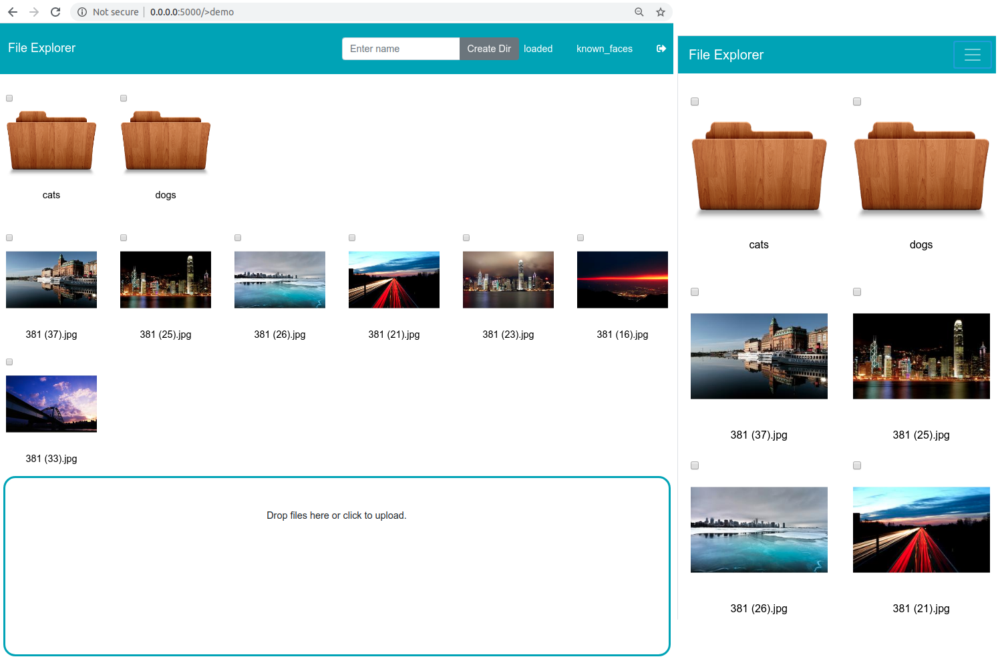

# Flask File Explorer and Image Galery Server #

A file explorer that works over local area network (Wi-Fi/Ethernet) using Flask server. You can explore a computer directory and download any file. Images have a preview.

It's fork of https://github.com/reallyrehan/flask-fileexplorer.git

It written on Python with flask, Bootstrap4 

Flask has been used to run the server and serve up the html pages. Meanwhile, Bootstrap has been used to show the Folders and the Files. To open any folder, just click on it and to download/stream any file, just click on it.

**How to Run**
-
Clone this repository by using,
    
    git clone https://github.com/mkaskov/FlaskExplorer.git

Make sure you have all dependencies installed. You can install it,

    pip install -r requirements.txt

Setting-up additional features (optional)

- **Password Protection**: Set a password in the config.json file.
- **Hiding Folders**: Add paths of folders to hide in the config.json file as a list.
- **Favorite Folders**: Add paths to add as favorites in the config.json file as a list.
- **Share only Specific Folder**: Give a path to the Root Directory or leave it as default '/' to share the complete computer directory.
    
Run app,

    python start.py
    
This should start the Flask Server in your terminal window. You can access it by going to,
- **localhost:5000** (on your server's browser)
- **(IP Address of your Server):5000** (from any other browser on the same network)

